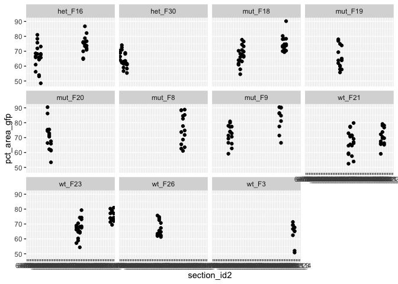
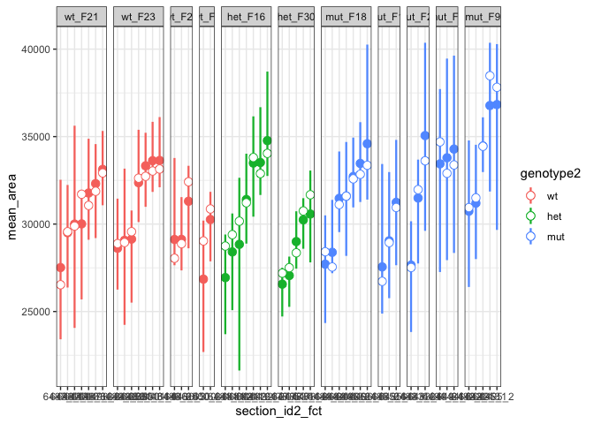

Jag2b mutant histology - 4 month mef2 IHC
================
Bradley Demarest
2022-11-30

#### jag2b heart muscle density data.

jag2b mutants, hets, and wildtype siblings were euthanized with
tricaine, hearts were explanted and placed in KCl solution, then fixed
and embedded for cryo-sectioning. Sections were stained with mef2
primary ab and detected with a gpf-conjugated(??) secondary ab. (Needs
confirmation from who??).

Stained sections were imaged with (what scope??).

``` r
# Load data.
tab = readxl::read_excel("mef2_histology_analysis_jag2b_4_month_2022-11-17_modified.xlsx")

tab = as.data.table(tab)

# Remove rows where notes columns contains 'ripped do not use'.
tab = tab[!notes %in% "ripped do not use"]

# Remove rows where fish_id is NA.
tab = tab[!is.na(fish_id)]
```

``` r
# Check to see how many sections per fish_id,
# and how many measurements per section.

# We need to use 'file_id' column to create an identifier that
# has a unique value for each measurement 
# (each 650px X 650px area of interest).

xtab1 = tab[, .N, by=list(fish_id, file_id, section_id, genotype)]

xtab1 %>% as_tibble() %>%
  group_by(fish_id, file_id) %>%
  gt()
```

<style>html {
  font-family: -apple-system, BlinkMacSystemFont, 'Segoe UI', Roboto, Oxygen, Ubuntu, Cantarell, 'Helvetica Neue', 'Fira Sans', 'Droid Sans', Arial, sans-serif;
}

#sgrbsbbuna .gt_table {
  display: table;
  border-collapse: collapse;
  margin-left: auto;
  /* table.margin.left */
  margin-right: auto;
  /* table.margin.right */
  color: #333333;
  font-size: 16px;
  /* table.font.size */
  background-color: #FFFFFF;
  /* table.background.color */
  width: auto;
  /* table.width */
  border-top-style: solid;
  /* table.border.top.style */
  border-top-width: 2px;
  /* table.border.top.width */
  border-top-color: #A8A8A8;
  /* table.border.top.color */
  border-bottom-style: solid;
  /* table.border.bottom.style */
  border-bottom-width: 2px;
  /* table.border.bottom.width */
  border-bottom-color: #A8A8A8;
  /* table.border.bottom.color */
}

#sgrbsbbuna .gt_heading {
  background-color: #FFFFFF;
  /* heading.background.color */
  border-bottom-color: #FFFFFF;
  /* table.background.color */
  border-left-style: hidden;
  /* heading.border.lr.style */
  border-left-width: 1px;
  /* heading.border.lr.width */
  border-left-color: #D3D3D3;
  /* heading.border.lr.color */
  border-right-style: hidden;
  /* heading.border.lr.style */
  border-right-width: 1px;
  /* heading.border.lr.width */
  border-right-color: #D3D3D3;
  /* heading.border.lr.color */
}

#sgrbsbbuna .gt_title {
  color: #333333;
  font-size: 125%;
  /* heading.title.font.size */
  font-weight: initial;
  /* heading.title.font.weight */
  padding-top: 4px;
  /* heading.top.padding - not yet used */
  padding-bottom: 4px;
  border-bottom-color: #FFFFFF;
  /* table.background.color */
  border-bottom-width: 0;
}

#sgrbsbbuna .gt_subtitle {
  color: #333333;
  font-size: 85%;
  /* heading.subtitle.font.size */
  font-weight: initial;
  /* heading.subtitle.font.weight */
  padding-top: 0;
  padding-bottom: 4px;
  /* heading.bottom.padding - not yet used */
  border-top-color: #FFFFFF;
  /* table.background.color */
  border-top-width: 0;
}

#sgrbsbbuna .gt_bottom_border {
  border-bottom-style: solid;
  /* heading.border.bottom.style */
  border-bottom-width: 2px;
  /* heading.border.bottom.width */
  border-bottom-color: #D3D3D3;
  /* heading.border.bottom.color */
}

#sgrbsbbuna .gt_column_spanner {
  border-bottom-style: solid;
  border-bottom-width: 2px;
  border-bottom-color: #D3D3D3;
  padding-top: 4px;
  padding-bottom: 4px;
}

#sgrbsbbuna .gt_col_headings {
  border-top-style: solid;
  /* column_labels.border.top.style */
  border-top-width: 2px;
  /* column_labels.border.top.width */
  border-top-color: #D3D3D3;
  /* column_labels.border.top.color */
  border-bottom-style: solid;
  /* column_labels.border.bottom.style */
  border-bottom-width: 2px;
  /* column_labels.border.bottom.width */
  border-bottom-color: #D3D3D3;
  /* column_labels.border.bottom.color */
  border-left-style: none;
  /* column_labels.border.lr.style */
  border-left-width: 1px;
  /* column_labels.border.lr.width */
  border-left-color: #D3D3D3;
  /* column_labels.border.lr.color */
  border-right-style: none;
  /* column_labels.border.lr.style */
  border-right-width: 1px;
  /* column_labels.border.lr.width */
  border-right-color: #D3D3D3;
  /* column_labels.border.lr.color */
}

#sgrbsbbuna .gt_col_heading {
  color: #333333;
  background-color: #FFFFFF;
  /* column_labels.background.color */
  font-size: 100%;
  /* column_labels.font.size */
  font-weight: normal;
  /* column_labels.font.weight */
  text-transform: inherit;
  /* column_labels.text_transform */
  vertical-align: middle;
  padding: 5px;
  margin: 10px;
  overflow-x: hidden;
}

#sgrbsbbuna .gt_sep_right {
  border-right: 5px solid #FFFFFF;
}

#sgrbsbbuna .gt_group_heading {
  padding: 8px;
  /* row_group.padding */
  color: #333333;
  background-color: #FFFFFF;
  /* row_group.background.color */
  font-size: 100%;
  /* row_group.font.size */
  font-weight: initial;
  /* row_group.font.weight */
  text-transform: inherit;
  /* row_group.text_transform */
  border-top-style: solid;
  /* row_group.border.top.style */
  border-top-width: 2px;
  /* row_group.border.top.width */
  border-top-color: #D3D3D3;
  /* row_group.border.top.color */
  border-bottom-style: solid;
  /* row_group.border.bottom.style */
  border-bottom-width: 2px;
  /* row_group.border.bottom.width */
  border-bottom-color: #D3D3D3;
  /* row_group.border.bottom.color */
  border-left-style: none;
  /* row_group.border.left.style */
  border-left-width: 1px;
  /* row_group.border.left.width */
  border-left-color: #D3D3D3;
  /* row_group.border.left.color */
  border-right-style: none;
  /* row_group.border.right.style */
  border-right-width: 1px;
  /* row_group.border.right.width */
  border-right-color: #D3D3D3;
  /* row_group.border.right.color */
  vertical-align: middle;
}

#sgrbsbbuna .gt_empty_group_heading {
  padding: 0.5px;
  color: #333333;
  background-color: #FFFFFF;
  /* row_group.background.color */
  font-size: 100%;
  /* row_group.font.size */
  font-weight: initial;
  /* row_group.font.weight */
  border-top-style: solid;
  /* row_group.border.top.style */
  border-top-width: 2px;
  /* row_group.border.top.width */
  border-top-color: #D3D3D3;
  /* row_group.border.top.color */
  border-bottom-style: solid;
  /* row_group.border.bottom.style */
  border-bottom-width: 2px;
  /* row_group.border.bottom.width */
  border-bottom-color: #D3D3D3;
  /* row_group.border.bottom.color */
  vertical-align: middle;
}

#sgrbsbbuna .gt_striped {
  background-color: rgba(128, 128, 128, 0.05);
  /* row.striping.background_color */
}

#sgrbsbbuna .gt_from_md > :first-child {
  margin-top: 0;
}

#sgrbsbbuna .gt_from_md > :last-child {
  margin-bottom: 0;
}

#sgrbsbbuna .gt_row {
  padding-top: 8px;
  /* data_row.padding */
  padding-bottom: 8px;
  /* data_row.padding */
  padding-left: 5px;
  padding-right: 5px;
  margin: 10px;
  border-top-style: solid;
  /* table_body.hlines.style */
  border-top-width: 1px;
  /* table_body.hlines.width */
  border-top-color: #D3D3D3;
  /* table_body.hlines.color */
  border-left-style: none;
  /* table_body.vlines.style */
  border-left-width: 1px;
  /* table_body.vlines.width */
  border-left-color: #D3D3D3;
  /* table_body.vlines.color */
  border-right-style: none;
  /* table_body.vlines.style */
  border-right-width: 1px;
  /* table_body.vlines.width */
  border-right-color: #D3D3D3;
  /* table_body.vlines.color */
  vertical-align: middle;
  overflow-x: hidden;
}

#sgrbsbbuna .gt_stub {
  color: #333333;
  background-color: #FFFFFF;
  /* stub.background.color */
  font-weight: initial;
  /* stub.font.weight */
  text-transform: inherit;
  /* stub.text_transform */
  border-right-style: solid;
  /* stub.border.style */
  border-right-width: 2px;
  /* stub.border.width */
  border-right-color: #D3D3D3;
  /* stub.border.color */
  padding-left: 12px;
}

#sgrbsbbuna .gt_summary_row {
  color: #333333;
  background-color: #FFFFFF;
  /* summary_row.background.color */
  text-transform: inherit;
  /* summary_row.text_transform */
  padding-top: 8px;
  /* summary_row.padding */
  padding-bottom: 8px;
  /* summary_row.padding */
  padding-left: 5px;
  padding-right: 5px;
}

#sgrbsbbuna .gt_first_summary_row {
  padding-top: 8px;
  /* summary_row.padding */
  padding-bottom: 8px;
  /* summary_row.padding */
  padding-left: 5px;
  padding-right: 5px;
  border-top-style: solid;
  /* summary_row.border.style */
  border-top-width: 2px;
  /* summary_row.border.width */
  border-top-color: #D3D3D3;
  /* summary_row.border.color */
}

#sgrbsbbuna .gt_grand_summary_row {
  color: #333333;
  background-color: #FFFFFF;
  /* grand_summary_row.background.color */
  text-transform: inherit;
  /* grand_summary_row.text_transform */
  padding-top: 8px;
  /* grand_summary_row.padding */
  padding-bottom: 8px;
  /* grand_summary_row.padding */
  padding-left: 5px;
  padding-right: 5px;
}

#sgrbsbbuna .gt_first_grand_summary_row {
  padding-top: 8px;
  /* grand_summary_row.padding */
  padding-bottom: 8px;
  /* grand_summary_row.padding */
  padding-left: 5px;
  padding-right: 5px;
  border-top-style: double;
  /* grand_summary_row.border.style */
  border-top-width: 6px;
  /* grand_summary_row.border.width */
  border-top-color: #D3D3D3;
  /* grand_summary_row.border.color */
}

#sgrbsbbuna .gt_table_body {
  border-top-style: solid;
  /* table_body.border.top.style */
  border-top-width: 2px;
  /* table_body.border.top.width */
  border-top-color: #D3D3D3;
  /* table_body.border.top.color */
  border-bottom-style: solid;
  /* table_body.border.bottom.style */
  border-bottom-width: 2px;
  /* table_body.border.bottom.width */
  border-bottom-color: #D3D3D3;
  /* table_body.border.bottom.color */
}

#sgrbsbbuna .gt_footnotes {
  color: #333333;
  background-color: #FFFFFF;
  /* footnotes.background.color */
  border-bottom-style: none;
  /* footnotes.border.bottom.style */
  border-bottom-width: 2px;
  /* footnotes.border.bottom.width */
  border-bottom-color: #D3D3D3;
  /* footnotes.border.bottom.color */
  border-left-style: none;
  /* footnotes.border.lr.color */
  border-left-width: 2px;
  /* footnotes.border.lr.color */
  border-left-color: #D3D3D3;
  /* footnotes.border.lr.color */
  border-right-style: none;
  /* footnotes.border.lr.color */
  border-right-width: 2px;
  /* footnotes.border.lr.color */
  border-right-color: #D3D3D3;
  /* footnotes.border.lr.color */
}

#sgrbsbbuna .gt_footnote {
  margin: 0px;
  font-size: 90%;
  /* footnotes.font.size */
  padding: 4px;
  /* footnotes.padding */
}

#sgrbsbbuna .gt_sourcenotes {
  color: #333333;
  background-color: #FFFFFF;
  /* source_notes.background.color */
  border-bottom-style: none;
  /* source_notes.border.bottom.style */
  border-bottom-width: 2px;
  /* source_notes.border.bottom.width */
  border-bottom-color: #D3D3D3;
  /* source_notes.border.bottom.color */
  border-left-style: none;
  /* source_notes.border.lr.style */
  border-left-width: 2px;
  /* source_notes.border.lr.style */
  border-left-color: #D3D3D3;
  /* source_notes.border.lr.style */
  border-right-style: none;
  /* source_notes.border.lr.style */
  border-right-width: 2px;
  /* source_notes.border.lr.style */
  border-right-color: #D3D3D3;
  /* source_notes.border.lr.style */
}

#sgrbsbbuna .gt_sourcenote {
  font-size: 90%;
  /* source_notes.font.size */
  padding: 4px;
  /* source_notes.padding */
}

#sgrbsbbuna .gt_left {
  text-align: left;
}

#sgrbsbbuna .gt_center {
  text-align: center;
}

#sgrbsbbuna .gt_right {
  text-align: right;
  font-variant-numeric: tabular-nums;
}

#sgrbsbbuna .gt_font_normal {
  font-weight: normal;
}

#sgrbsbbuna .gt_font_bold {
  font-weight: bold;
}

#sgrbsbbuna .gt_font_italic {
  font-style: italic;
}

#sgrbsbbuna .gt_super {
  font-size: 65%;
}

#sgrbsbbuna .gt_footnote_marks {
  font-style: italic;
  font-size: 65%;
}
</style>
<div id="sgrbsbbuna" style="overflow-x:auto;overflow-y:auto;width:auto;height:auto;"><table class="gt_table">
  
  <thead class="gt_col_headings">
    <tr>
      <th class="gt_col_heading gt_columns_bottom_border gt_right" rowspan="1" colspan="1">section_id</th>
      <th class="gt_col_heading gt_columns_bottom_border gt_left" rowspan="1" colspan="1">genotype</th>
      <th class="gt_col_heading gt_columns_bottom_border gt_center" rowspan="1" colspan="1">N</th>
    </tr>
  </thead>
  <tbody class="gt_table_body">
    <tr class="gt_group_heading_row">
      <td colspan="3" class="gt_group_heading">F30 - 6478</td>
    </tr>
    <tr>
      <td class="gt_row gt_right">1</td>
      <td class="gt_row gt_left">het</td>
      <td class="gt_row gt_center">5</td>
    </tr>
    <tr>
      <td class="gt_row gt_right gt_striped">2</td>
      <td class="gt_row gt_left gt_striped">het</td>
      <td class="gt_row gt_center gt_striped">5</td>
    </tr>
    <tr>
      <td class="gt_row gt_right">3</td>
      <td class="gt_row gt_left">het</td>
      <td class="gt_row gt_center">5</td>
    </tr>
    <tr>
      <td class="gt_row gt_right gt_striped">4</td>
      <td class="gt_row gt_left gt_striped">het</td>
      <td class="gt_row gt_center gt_striped">5</td>
    </tr>
    <tr>
      <td class="gt_row gt_right">5</td>
      <td class="gt_row gt_left">het</td>
      <td class="gt_row gt_center">5</td>
    </tr>
    <tr class="gt_group_heading_row">
      <td colspan="3" class="gt_group_heading">F9 - 6482</td>
    </tr>
    <tr>
      <td class="gt_row gt_right gt_striped">1</td>
      <td class="gt_row gt_left gt_striped">mut</td>
      <td class="gt_row gt_center gt_striped">5</td>
    </tr>
    <tr>
      <td class="gt_row gt_right">3</td>
      <td class="gt_row gt_left">mut</td>
      <td class="gt_row gt_center">5</td>
    </tr>
    <tr>
      <td class="gt_row gt_right gt_striped">4</td>
      <td class="gt_row gt_left gt_striped">mut</td>
      <td class="gt_row gt_center gt_striped">5</td>
    </tr>
    <tr class="gt_group_heading_row">
      <td colspan="3" class="gt_group_heading">F20 - 6483</td>
    </tr>
    <tr>
      <td class="gt_row gt_right">1</td>
      <td class="gt_row gt_left">mut</td>
      <td class="gt_row gt_center">5</td>
    </tr>
    <tr>
      <td class="gt_row gt_right gt_striped">2</td>
      <td class="gt_row gt_left gt_striped">mut</td>
      <td class="gt_row gt_center gt_striped">5</td>
    </tr>
    <tr>
      <td class="gt_row gt_right">4</td>
      <td class="gt_row gt_left">mut</td>
      <td class="gt_row gt_center">5</td>
    </tr>
    <tr class="gt_group_heading_row">
      <td colspan="3" class="gt_group_heading">F18 - 6484</td>
    </tr>
    <tr>
      <td class="gt_row gt_right gt_striped">1</td>
      <td class="gt_row gt_left gt_striped">mut</td>
      <td class="gt_row gt_center gt_striped">5</td>
    </tr>
    <tr>
      <td class="gt_row gt_right">2</td>
      <td class="gt_row gt_left">mut</td>
      <td class="gt_row gt_center">5</td>
    </tr>
    <tr>
      <td class="gt_row gt_right gt_striped">3</td>
      <td class="gt_row gt_left gt_striped">mut</td>
      <td class="gt_row gt_center gt_striped">5</td>
    </tr>
    <tr>
      <td class="gt_row gt_right">4</td>
      <td class="gt_row gt_left">mut</td>
      <td class="gt_row gt_center">5</td>
    </tr>
    <tr class="gt_group_heading_row">
      <td colspan="3" class="gt_group_heading">F19 - 6485</td>
    </tr>
    <tr>
      <td class="gt_row gt_right gt_striped">1</td>
      <td class="gt_row gt_left gt_striped">mut</td>
      <td class="gt_row gt_center gt_striped">5</td>
    </tr>
    <tr>
      <td class="gt_row gt_right">2</td>
      <td class="gt_row gt_left">mut</td>
      <td class="gt_row gt_center">5</td>
    </tr>
    <tr>
      <td class="gt_row gt_right gt_striped">4</td>
      <td class="gt_row gt_left gt_striped">mut</td>
      <td class="gt_row gt_center gt_striped">5</td>
    </tr>
    <tr class="gt_group_heading_row">
      <td colspan="3" class="gt_group_heading">F8 - 6494</td>
    </tr>
    <tr>
      <td class="gt_row gt_right">1</td>
      <td class="gt_row gt_left">mut</td>
      <td class="gt_row gt_center">5</td>
    </tr>
    <tr>
      <td class="gt_row gt_right gt_striped">2</td>
      <td class="gt_row gt_left gt_striped">mut</td>
      <td class="gt_row gt_center gt_striped">5</td>
    </tr>
    <tr>
      <td class="gt_row gt_right">3</td>
      <td class="gt_row gt_left">mut</td>
      <td class="gt_row gt_center">5</td>
    </tr>
    <tr class="gt_group_heading_row">
      <td colspan="3" class="gt_group_heading">F9 - 6495</td>
    </tr>
    <tr>
      <td class="gt_row gt_right gt_striped">1</td>
      <td class="gt_row gt_left gt_striped">mut</td>
      <td class="gt_row gt_center gt_striped">5</td>
    </tr>
    <tr>
      <td class="gt_row gt_right">2</td>
      <td class="gt_row gt_left">mut</td>
      <td class="gt_row gt_center">5</td>
    </tr>
    <tr class="gt_group_heading_row">
      <td colspan="3" class="gt_group_heading">F18 - 6496</td>
    </tr>
    <tr>
      <td class="gt_row gt_right gt_striped">1</td>
      <td class="gt_row gt_left gt_striped">mut</td>
      <td class="gt_row gt_center gt_striped">5</td>
    </tr>
    <tr>
      <td class="gt_row gt_right">2</td>
      <td class="gt_row gt_left">mut</td>
      <td class="gt_row gt_center">5</td>
    </tr>
    <tr>
      <td class="gt_row gt_right gt_striped">3</td>
      <td class="gt_row gt_left gt_striped">mut</td>
      <td class="gt_row gt_center gt_striped">5</td>
    </tr>
    <tr class="gt_group_heading_row">
      <td colspan="3" class="gt_group_heading">F26 - 6486</td>
    </tr>
    <tr>
      <td class="gt_row gt_right">2</td>
      <td class="gt_row gt_left">wt</td>
      <td class="gt_row gt_center">5</td>
    </tr>
    <tr>
      <td class="gt_row gt_right gt_striped">3</td>
      <td class="gt_row gt_left gt_striped">wt</td>
      <td class="gt_row gt_center gt_striped">5</td>
    </tr>
    <tr>
      <td class="gt_row gt_right">4</td>
      <td class="gt_row gt_left">wt</td>
      <td class="gt_row gt_center">5</td>
    </tr>
    <tr class="gt_group_heading_row">
      <td colspan="3" class="gt_group_heading">F21 - 6487</td>
    </tr>
    <tr>
      <td class="gt_row gt_right gt_striped">1</td>
      <td class="gt_row gt_left gt_striped">wt</td>
      <td class="gt_row gt_center gt_striped">5</td>
    </tr>
    <tr>
      <td class="gt_row gt_right">2</td>
      <td class="gt_row gt_left">wt</td>
      <td class="gt_row gt_center">5</td>
    </tr>
    <tr>
      <td class="gt_row gt_right gt_striped">3</td>
      <td class="gt_row gt_left gt_striped">wt</td>
      <td class="gt_row gt_center gt_striped">5</td>
    </tr>
    <tr>
      <td class="gt_row gt_right">4</td>
      <td class="gt_row gt_left">wt</td>
      <td class="gt_row gt_center">5</td>
    </tr>
    <tr class="gt_group_heading_row">
      <td colspan="3" class="gt_group_heading">F23 - 6489</td>
    </tr>
    <tr>
      <td class="gt_row gt_right gt_striped">1</td>
      <td class="gt_row gt_left gt_striped">wt</td>
      <td class="gt_row gt_center gt_striped">5</td>
    </tr>
    <tr>
      <td class="gt_row gt_right">2</td>
      <td class="gt_row gt_left">wt</td>
      <td class="gt_row gt_center">5</td>
    </tr>
    <tr>
      <td class="gt_row gt_right gt_striped">3</td>
      <td class="gt_row gt_left gt_striped">wt</td>
      <td class="gt_row gt_center gt_striped">5</td>
    </tr>
    <tr>
      <td class="gt_row gt_right">4</td>
      <td class="gt_row gt_left">wt</td>
      <td class="gt_row gt_center">5</td>
    </tr>
    <tr class="gt_group_heading_row">
      <td colspan="3" class="gt_group_heading">F16 - 6481</td>
    </tr>
    <tr>
      <td class="gt_row gt_right gt_striped">1</td>
      <td class="gt_row gt_left gt_striped">het</td>
      <td class="gt_row gt_center gt_striped">5</td>
    </tr>
    <tr>
      <td class="gt_row gt_right">2</td>
      <td class="gt_row gt_left">het</td>
      <td class="gt_row gt_center">5</td>
    </tr>
    <tr>
      <td class="gt_row gt_right gt_striped">3</td>
      <td class="gt_row gt_left gt_striped">het</td>
      <td class="gt_row gt_center gt_striped">5</td>
    </tr>
    <tr>
      <td class="gt_row gt_right">4</td>
      <td class="gt_row gt_left">het</td>
      <td class="gt_row gt_center">5</td>
    </tr>
    <tr class="gt_group_heading_row">
      <td colspan="3" class="gt_group_heading">F16 - 6492</td>
    </tr>
    <tr>
      <td class="gt_row gt_right gt_striped">1</td>
      <td class="gt_row gt_left gt_striped">het</td>
      <td class="gt_row gt_center gt_striped">5</td>
    </tr>
    <tr>
      <td class="gt_row gt_right">2</td>
      <td class="gt_row gt_left">het</td>
      <td class="gt_row gt_center">5</td>
    </tr>
    <tr>
      <td class="gt_row gt_right gt_striped">3</td>
      <td class="gt_row gt_left gt_striped">het</td>
      <td class="gt_row gt_center gt_striped">5</td>
    </tr>
    <tr class="gt_group_heading_row">
      <td colspan="3" class="gt_group_heading">F21 - 6498</td>
    </tr>
    <tr>
      <td class="gt_row gt_right">1</td>
      <td class="gt_row gt_left">wt</td>
      <td class="gt_row gt_center">5</td>
    </tr>
    <tr>
      <td class="gt_row gt_right gt_striped">2</td>
      <td class="gt_row gt_left gt_striped">wt</td>
      <td class="gt_row gt_center gt_striped">5</td>
    </tr>
    <tr>
      <td class="gt_row gt_right">3</td>
      <td class="gt_row gt_left">wt</td>
      <td class="gt_row gt_center">5</td>
    </tr>
    <tr class="gt_group_heading_row">
      <td colspan="3" class="gt_group_heading">F3 - 6500</td>
    </tr>
    <tr>
      <td class="gt_row gt_right gt_striped">1</td>
      <td class="gt_row gt_left gt_striped">wt</td>
      <td class="gt_row gt_center gt_striped">5</td>
    </tr>
    <tr>
      <td class="gt_row gt_right">2</td>
      <td class="gt_row gt_left">wt</td>
      <td class="gt_row gt_center">5</td>
    </tr>
    <tr class="gt_group_heading_row">
      <td colspan="3" class="gt_group_heading">F23 - 6501</td>
    </tr>
    <tr>
      <td class="gt_row gt_right gt_striped">1</td>
      <td class="gt_row gt_left gt_striped">wt</td>
      <td class="gt_row gt_center gt_striped">5</td>
    </tr>
    <tr>
      <td class="gt_row gt_right">3</td>
      <td class="gt_row gt_left">wt</td>
      <td class="gt_row gt_center">5</td>
    </tr>
    <tr>
      <td class="gt_row gt_right gt_striped">4</td>
      <td class="gt_row gt_left gt_striped">wt</td>
      <td class="gt_row gt_center gt_striped">5</td>
    </tr>
  </tbody>
  
  
</table></div>

``` r
# Create unique measurment id column.
# Need to use: fish_id, file_id, section_id, measurement_id.

tab[, id2:=paste(fish_id, "_", file_id, "_S", 
                 section_id, "_M", measurement_id, 
                 sep="")]

length(unique(tab$id2))
```

    ## [1] 260

``` r
# Unique identifier for each section.
tab[, section_id2:=paste(file_id, section_id, sep="_")]

# fish_id2 with genotype included.
tab[, fish_id2:=paste(genotype, fish_id, sep="_")]
```

``` r
# Number of sections per fish_id
xtab2 = tab[, .N, by=list(fish_id2, fish_id, genotype, section_id2)]

xtab2 %>% as_tibble() %>%
  group_by(fish_id2) %>%
  gt()
```

<style>html {
  font-family: -apple-system, BlinkMacSystemFont, 'Segoe UI', Roboto, Oxygen, Ubuntu, Cantarell, 'Helvetica Neue', 'Fira Sans', 'Droid Sans', Arial, sans-serif;
}

#cswsmnwdew .gt_table {
  display: table;
  border-collapse: collapse;
  margin-left: auto;
  /* table.margin.left */
  margin-right: auto;
  /* table.margin.right */
  color: #333333;
  font-size: 16px;
  /* table.font.size */
  background-color: #FFFFFF;
  /* table.background.color */
  width: auto;
  /* table.width */
  border-top-style: solid;
  /* table.border.top.style */
  border-top-width: 2px;
  /* table.border.top.width */
  border-top-color: #A8A8A8;
  /* table.border.top.color */
  border-bottom-style: solid;
  /* table.border.bottom.style */
  border-bottom-width: 2px;
  /* table.border.bottom.width */
  border-bottom-color: #A8A8A8;
  /* table.border.bottom.color */
}

#cswsmnwdew .gt_heading {
  background-color: #FFFFFF;
  /* heading.background.color */
  border-bottom-color: #FFFFFF;
  /* table.background.color */
  border-left-style: hidden;
  /* heading.border.lr.style */
  border-left-width: 1px;
  /* heading.border.lr.width */
  border-left-color: #D3D3D3;
  /* heading.border.lr.color */
  border-right-style: hidden;
  /* heading.border.lr.style */
  border-right-width: 1px;
  /* heading.border.lr.width */
  border-right-color: #D3D3D3;
  /* heading.border.lr.color */
}

#cswsmnwdew .gt_title {
  color: #333333;
  font-size: 125%;
  /* heading.title.font.size */
  font-weight: initial;
  /* heading.title.font.weight */
  padding-top: 4px;
  /* heading.top.padding - not yet used */
  padding-bottom: 4px;
  border-bottom-color: #FFFFFF;
  /* table.background.color */
  border-bottom-width: 0;
}

#cswsmnwdew .gt_subtitle {
  color: #333333;
  font-size: 85%;
  /* heading.subtitle.font.size */
  font-weight: initial;
  /* heading.subtitle.font.weight */
  padding-top: 0;
  padding-bottom: 4px;
  /* heading.bottom.padding - not yet used */
  border-top-color: #FFFFFF;
  /* table.background.color */
  border-top-width: 0;
}

#cswsmnwdew .gt_bottom_border {
  border-bottom-style: solid;
  /* heading.border.bottom.style */
  border-bottom-width: 2px;
  /* heading.border.bottom.width */
  border-bottom-color: #D3D3D3;
  /* heading.border.bottom.color */
}

#cswsmnwdew .gt_column_spanner {
  border-bottom-style: solid;
  border-bottom-width: 2px;
  border-bottom-color: #D3D3D3;
  padding-top: 4px;
  padding-bottom: 4px;
}

#cswsmnwdew .gt_col_headings {
  border-top-style: solid;
  /* column_labels.border.top.style */
  border-top-width: 2px;
  /* column_labels.border.top.width */
  border-top-color: #D3D3D3;
  /* column_labels.border.top.color */
  border-bottom-style: solid;
  /* column_labels.border.bottom.style */
  border-bottom-width: 2px;
  /* column_labels.border.bottom.width */
  border-bottom-color: #D3D3D3;
  /* column_labels.border.bottom.color */
  border-left-style: none;
  /* column_labels.border.lr.style */
  border-left-width: 1px;
  /* column_labels.border.lr.width */
  border-left-color: #D3D3D3;
  /* column_labels.border.lr.color */
  border-right-style: none;
  /* column_labels.border.lr.style */
  border-right-width: 1px;
  /* column_labels.border.lr.width */
  border-right-color: #D3D3D3;
  /* column_labels.border.lr.color */
}

#cswsmnwdew .gt_col_heading {
  color: #333333;
  background-color: #FFFFFF;
  /* column_labels.background.color */
  font-size: 100%;
  /* column_labels.font.size */
  font-weight: normal;
  /* column_labels.font.weight */
  text-transform: inherit;
  /* column_labels.text_transform */
  vertical-align: middle;
  padding: 5px;
  margin: 10px;
  overflow-x: hidden;
}

#cswsmnwdew .gt_sep_right {
  border-right: 5px solid #FFFFFF;
}

#cswsmnwdew .gt_group_heading {
  padding: 8px;
  /* row_group.padding */
  color: #333333;
  background-color: #FFFFFF;
  /* row_group.background.color */
  font-size: 100%;
  /* row_group.font.size */
  font-weight: initial;
  /* row_group.font.weight */
  text-transform: inherit;
  /* row_group.text_transform */
  border-top-style: solid;
  /* row_group.border.top.style */
  border-top-width: 2px;
  /* row_group.border.top.width */
  border-top-color: #D3D3D3;
  /* row_group.border.top.color */
  border-bottom-style: solid;
  /* row_group.border.bottom.style */
  border-bottom-width: 2px;
  /* row_group.border.bottom.width */
  border-bottom-color: #D3D3D3;
  /* row_group.border.bottom.color */
  border-left-style: none;
  /* row_group.border.left.style */
  border-left-width: 1px;
  /* row_group.border.left.width */
  border-left-color: #D3D3D3;
  /* row_group.border.left.color */
  border-right-style: none;
  /* row_group.border.right.style */
  border-right-width: 1px;
  /* row_group.border.right.width */
  border-right-color: #D3D3D3;
  /* row_group.border.right.color */
  vertical-align: middle;
}

#cswsmnwdew .gt_empty_group_heading {
  padding: 0.5px;
  color: #333333;
  background-color: #FFFFFF;
  /* row_group.background.color */
  font-size: 100%;
  /* row_group.font.size */
  font-weight: initial;
  /* row_group.font.weight */
  border-top-style: solid;
  /* row_group.border.top.style */
  border-top-width: 2px;
  /* row_group.border.top.width */
  border-top-color: #D3D3D3;
  /* row_group.border.top.color */
  border-bottom-style: solid;
  /* row_group.border.bottom.style */
  border-bottom-width: 2px;
  /* row_group.border.bottom.width */
  border-bottom-color: #D3D3D3;
  /* row_group.border.bottom.color */
  vertical-align: middle;
}

#cswsmnwdew .gt_striped {
  background-color: rgba(128, 128, 128, 0.05);
  /* row.striping.background_color */
}

#cswsmnwdew .gt_from_md > :first-child {
  margin-top: 0;
}

#cswsmnwdew .gt_from_md > :last-child {
  margin-bottom: 0;
}

#cswsmnwdew .gt_row {
  padding-top: 8px;
  /* data_row.padding */
  padding-bottom: 8px;
  /* data_row.padding */
  padding-left: 5px;
  padding-right: 5px;
  margin: 10px;
  border-top-style: solid;
  /* table_body.hlines.style */
  border-top-width: 1px;
  /* table_body.hlines.width */
  border-top-color: #D3D3D3;
  /* table_body.hlines.color */
  border-left-style: none;
  /* table_body.vlines.style */
  border-left-width: 1px;
  /* table_body.vlines.width */
  border-left-color: #D3D3D3;
  /* table_body.vlines.color */
  border-right-style: none;
  /* table_body.vlines.style */
  border-right-width: 1px;
  /* table_body.vlines.width */
  border-right-color: #D3D3D3;
  /* table_body.vlines.color */
  vertical-align: middle;
  overflow-x: hidden;
}

#cswsmnwdew .gt_stub {
  color: #333333;
  background-color: #FFFFFF;
  /* stub.background.color */
  font-weight: initial;
  /* stub.font.weight */
  text-transform: inherit;
  /* stub.text_transform */
  border-right-style: solid;
  /* stub.border.style */
  border-right-width: 2px;
  /* stub.border.width */
  border-right-color: #D3D3D3;
  /* stub.border.color */
  padding-left: 12px;
}

#cswsmnwdew .gt_summary_row {
  color: #333333;
  background-color: #FFFFFF;
  /* summary_row.background.color */
  text-transform: inherit;
  /* summary_row.text_transform */
  padding-top: 8px;
  /* summary_row.padding */
  padding-bottom: 8px;
  /* summary_row.padding */
  padding-left: 5px;
  padding-right: 5px;
}

#cswsmnwdew .gt_first_summary_row {
  padding-top: 8px;
  /* summary_row.padding */
  padding-bottom: 8px;
  /* summary_row.padding */
  padding-left: 5px;
  padding-right: 5px;
  border-top-style: solid;
  /* summary_row.border.style */
  border-top-width: 2px;
  /* summary_row.border.width */
  border-top-color: #D3D3D3;
  /* summary_row.border.color */
}

#cswsmnwdew .gt_grand_summary_row {
  color: #333333;
  background-color: #FFFFFF;
  /* grand_summary_row.background.color */
  text-transform: inherit;
  /* grand_summary_row.text_transform */
  padding-top: 8px;
  /* grand_summary_row.padding */
  padding-bottom: 8px;
  /* grand_summary_row.padding */
  padding-left: 5px;
  padding-right: 5px;
}

#cswsmnwdew .gt_first_grand_summary_row {
  padding-top: 8px;
  /* grand_summary_row.padding */
  padding-bottom: 8px;
  /* grand_summary_row.padding */
  padding-left: 5px;
  padding-right: 5px;
  border-top-style: double;
  /* grand_summary_row.border.style */
  border-top-width: 6px;
  /* grand_summary_row.border.width */
  border-top-color: #D3D3D3;
  /* grand_summary_row.border.color */
}

#cswsmnwdew .gt_table_body {
  border-top-style: solid;
  /* table_body.border.top.style */
  border-top-width: 2px;
  /* table_body.border.top.width */
  border-top-color: #D3D3D3;
  /* table_body.border.top.color */
  border-bottom-style: solid;
  /* table_body.border.bottom.style */
  border-bottom-width: 2px;
  /* table_body.border.bottom.width */
  border-bottom-color: #D3D3D3;
  /* table_body.border.bottom.color */
}

#cswsmnwdew .gt_footnotes {
  color: #333333;
  background-color: #FFFFFF;
  /* footnotes.background.color */
  border-bottom-style: none;
  /* footnotes.border.bottom.style */
  border-bottom-width: 2px;
  /* footnotes.border.bottom.width */
  border-bottom-color: #D3D3D3;
  /* footnotes.border.bottom.color */
  border-left-style: none;
  /* footnotes.border.lr.color */
  border-left-width: 2px;
  /* footnotes.border.lr.color */
  border-left-color: #D3D3D3;
  /* footnotes.border.lr.color */
  border-right-style: none;
  /* footnotes.border.lr.color */
  border-right-width: 2px;
  /* footnotes.border.lr.color */
  border-right-color: #D3D3D3;
  /* footnotes.border.lr.color */
}

#cswsmnwdew .gt_footnote {
  margin: 0px;
  font-size: 90%;
  /* footnotes.font.size */
  padding: 4px;
  /* footnotes.padding */
}

#cswsmnwdew .gt_sourcenotes {
  color: #333333;
  background-color: #FFFFFF;
  /* source_notes.background.color */
  border-bottom-style: none;
  /* source_notes.border.bottom.style */
  border-bottom-width: 2px;
  /* source_notes.border.bottom.width */
  border-bottom-color: #D3D3D3;
  /* source_notes.border.bottom.color */
  border-left-style: none;
  /* source_notes.border.lr.style */
  border-left-width: 2px;
  /* source_notes.border.lr.style */
  border-left-color: #D3D3D3;
  /* source_notes.border.lr.style */
  border-right-style: none;
  /* source_notes.border.lr.style */
  border-right-width: 2px;
  /* source_notes.border.lr.style */
  border-right-color: #D3D3D3;
  /* source_notes.border.lr.style */
}

#cswsmnwdew .gt_sourcenote {
  font-size: 90%;
  /* source_notes.font.size */
  padding: 4px;
  /* source_notes.padding */
}

#cswsmnwdew .gt_left {
  text-align: left;
}

#cswsmnwdew .gt_center {
  text-align: center;
}

#cswsmnwdew .gt_right {
  text-align: right;
  font-variant-numeric: tabular-nums;
}

#cswsmnwdew .gt_font_normal {
  font-weight: normal;
}

#cswsmnwdew .gt_font_bold {
  font-weight: bold;
}

#cswsmnwdew .gt_font_italic {
  font-style: italic;
}

#cswsmnwdew .gt_super {
  font-size: 65%;
}

#cswsmnwdew .gt_footnote_marks {
  font-style: italic;
  font-size: 65%;
}
</style>
<div id="cswsmnwdew" style="overflow-x:auto;overflow-y:auto;width:auto;height:auto;"><table class="gt_table">
  
  <thead class="gt_col_headings">
    <tr>
      <th class="gt_col_heading gt_columns_bottom_border gt_left" rowspan="1" colspan="1">fish_id</th>
      <th class="gt_col_heading gt_columns_bottom_border gt_left" rowspan="1" colspan="1">genotype</th>
      <th class="gt_col_heading gt_columns_bottom_border gt_left" rowspan="1" colspan="1">section_id2</th>
      <th class="gt_col_heading gt_columns_bottom_border gt_center" rowspan="1" colspan="1">N</th>
    </tr>
  </thead>
  <tbody class="gt_table_body">
    <tr class="gt_group_heading_row">
      <td colspan="4" class="gt_group_heading">het_F30</td>
    </tr>
    <tr>
      <td class="gt_row gt_left">F30</td>
      <td class="gt_row gt_left">het</td>
      <td class="gt_row gt_left">6478_1</td>
      <td class="gt_row gt_center">5</td>
    </tr>
    <tr>
      <td class="gt_row gt_left gt_striped">F30</td>
      <td class="gt_row gt_left gt_striped">het</td>
      <td class="gt_row gt_left gt_striped">6478_2</td>
      <td class="gt_row gt_center gt_striped">5</td>
    </tr>
    <tr>
      <td class="gt_row gt_left">F30</td>
      <td class="gt_row gt_left">het</td>
      <td class="gt_row gt_left">6478_3</td>
      <td class="gt_row gt_center">5</td>
    </tr>
    <tr>
      <td class="gt_row gt_left gt_striped">F30</td>
      <td class="gt_row gt_left gt_striped">het</td>
      <td class="gt_row gt_left gt_striped">6478_4</td>
      <td class="gt_row gt_center gt_striped">5</td>
    </tr>
    <tr>
      <td class="gt_row gt_left">F30</td>
      <td class="gt_row gt_left">het</td>
      <td class="gt_row gt_left">6478_5</td>
      <td class="gt_row gt_center">5</td>
    </tr>
    <tr class="gt_group_heading_row">
      <td colspan="4" class="gt_group_heading">mut_F9</td>
    </tr>
    <tr>
      <td class="gt_row gt_left gt_striped">F9</td>
      <td class="gt_row gt_left gt_striped">mut</td>
      <td class="gt_row gt_left gt_striped">6482_1</td>
      <td class="gt_row gt_center gt_striped">5</td>
    </tr>
    <tr>
      <td class="gt_row gt_left">F9</td>
      <td class="gt_row gt_left">mut</td>
      <td class="gt_row gt_left">6482_3</td>
      <td class="gt_row gt_center">5</td>
    </tr>
    <tr>
      <td class="gt_row gt_left gt_striped">F9</td>
      <td class="gt_row gt_left gt_striped">mut</td>
      <td class="gt_row gt_left gt_striped">6482_4</td>
      <td class="gt_row gt_center gt_striped">5</td>
    </tr>
    <tr>
      <td class="gt_row gt_left">F9</td>
      <td class="gt_row gt_left">mut</td>
      <td class="gt_row gt_left">6495_1</td>
      <td class="gt_row gt_center">5</td>
    </tr>
    <tr>
      <td class="gt_row gt_left gt_striped">F9</td>
      <td class="gt_row gt_left gt_striped">mut</td>
      <td class="gt_row gt_left gt_striped">6495_2</td>
      <td class="gt_row gt_center gt_striped">5</td>
    </tr>
    <tr class="gt_group_heading_row">
      <td colspan="4" class="gt_group_heading">mut_F20</td>
    </tr>
    <tr>
      <td class="gt_row gt_left">F20</td>
      <td class="gt_row gt_left">mut</td>
      <td class="gt_row gt_left">6483_1</td>
      <td class="gt_row gt_center">5</td>
    </tr>
    <tr>
      <td class="gt_row gt_left gt_striped">F20</td>
      <td class="gt_row gt_left gt_striped">mut</td>
      <td class="gt_row gt_left gt_striped">6483_2</td>
      <td class="gt_row gt_center gt_striped">5</td>
    </tr>
    <tr>
      <td class="gt_row gt_left">F20</td>
      <td class="gt_row gt_left">mut</td>
      <td class="gt_row gt_left">6483_4</td>
      <td class="gt_row gt_center">5</td>
    </tr>
    <tr class="gt_group_heading_row">
      <td colspan="4" class="gt_group_heading">mut_F18</td>
    </tr>
    <tr>
      <td class="gt_row gt_left gt_striped">F18</td>
      <td class="gt_row gt_left gt_striped">mut</td>
      <td class="gt_row gt_left gt_striped">6484_1</td>
      <td class="gt_row gt_center gt_striped">5</td>
    </tr>
    <tr>
      <td class="gt_row gt_left">F18</td>
      <td class="gt_row gt_left">mut</td>
      <td class="gt_row gt_left">6484_2</td>
      <td class="gt_row gt_center">5</td>
    </tr>
    <tr>
      <td class="gt_row gt_left gt_striped">F18</td>
      <td class="gt_row gt_left gt_striped">mut</td>
      <td class="gt_row gt_left gt_striped">6484_3</td>
      <td class="gt_row gt_center gt_striped">5</td>
    </tr>
    <tr>
      <td class="gt_row gt_left">F18</td>
      <td class="gt_row gt_left">mut</td>
      <td class="gt_row gt_left">6484_4</td>
      <td class="gt_row gt_center">5</td>
    </tr>
    <tr>
      <td class="gt_row gt_left gt_striped">F18</td>
      <td class="gt_row gt_left gt_striped">mut</td>
      <td class="gt_row gt_left gt_striped">6496_1</td>
      <td class="gt_row gt_center gt_striped">5</td>
    </tr>
    <tr>
      <td class="gt_row gt_left">F18</td>
      <td class="gt_row gt_left">mut</td>
      <td class="gt_row gt_left">6496_2</td>
      <td class="gt_row gt_center">5</td>
    </tr>
    <tr>
      <td class="gt_row gt_left gt_striped">F18</td>
      <td class="gt_row gt_left gt_striped">mut</td>
      <td class="gt_row gt_left gt_striped">6496_3</td>
      <td class="gt_row gt_center gt_striped">5</td>
    </tr>
    <tr class="gt_group_heading_row">
      <td colspan="4" class="gt_group_heading">mut_F19</td>
    </tr>
    <tr>
      <td class="gt_row gt_left">F19</td>
      <td class="gt_row gt_left">mut</td>
      <td class="gt_row gt_left">6485_1</td>
      <td class="gt_row gt_center">5</td>
    </tr>
    <tr>
      <td class="gt_row gt_left gt_striped">F19</td>
      <td class="gt_row gt_left gt_striped">mut</td>
      <td class="gt_row gt_left gt_striped">6485_2</td>
      <td class="gt_row gt_center gt_striped">5</td>
    </tr>
    <tr>
      <td class="gt_row gt_left">F19</td>
      <td class="gt_row gt_left">mut</td>
      <td class="gt_row gt_left">6485_4</td>
      <td class="gt_row gt_center">5</td>
    </tr>
    <tr class="gt_group_heading_row">
      <td colspan="4" class="gt_group_heading">mut_F8</td>
    </tr>
    <tr>
      <td class="gt_row gt_left gt_striped">F8</td>
      <td class="gt_row gt_left gt_striped">mut</td>
      <td class="gt_row gt_left gt_striped">6494_1</td>
      <td class="gt_row gt_center gt_striped">5</td>
    </tr>
    <tr>
      <td class="gt_row gt_left">F8</td>
      <td class="gt_row gt_left">mut</td>
      <td class="gt_row gt_left">6494_2</td>
      <td class="gt_row gt_center">5</td>
    </tr>
    <tr>
      <td class="gt_row gt_left gt_striped">F8</td>
      <td class="gt_row gt_left gt_striped">mut</td>
      <td class="gt_row gt_left gt_striped">6494_3</td>
      <td class="gt_row gt_center gt_striped">5</td>
    </tr>
    <tr class="gt_group_heading_row">
      <td colspan="4" class="gt_group_heading">wt_F26</td>
    </tr>
    <tr>
      <td class="gt_row gt_left">F26</td>
      <td class="gt_row gt_left">wt</td>
      <td class="gt_row gt_left">6486_2</td>
      <td class="gt_row gt_center">5</td>
    </tr>
    <tr>
      <td class="gt_row gt_left gt_striped">F26</td>
      <td class="gt_row gt_left gt_striped">wt</td>
      <td class="gt_row gt_left gt_striped">6486_3</td>
      <td class="gt_row gt_center gt_striped">5</td>
    </tr>
    <tr>
      <td class="gt_row gt_left">F26</td>
      <td class="gt_row gt_left">wt</td>
      <td class="gt_row gt_left">6486_4</td>
      <td class="gt_row gt_center">5</td>
    </tr>
    <tr class="gt_group_heading_row">
      <td colspan="4" class="gt_group_heading">wt_F21</td>
    </tr>
    <tr>
      <td class="gt_row gt_left gt_striped">F21</td>
      <td class="gt_row gt_left gt_striped">wt</td>
      <td class="gt_row gt_left gt_striped">6487_1</td>
      <td class="gt_row gt_center gt_striped">5</td>
    </tr>
    <tr>
      <td class="gt_row gt_left">F21</td>
      <td class="gt_row gt_left">wt</td>
      <td class="gt_row gt_left">6487_2</td>
      <td class="gt_row gt_center">5</td>
    </tr>
    <tr>
      <td class="gt_row gt_left gt_striped">F21</td>
      <td class="gt_row gt_left gt_striped">wt</td>
      <td class="gt_row gt_left gt_striped">6487_3</td>
      <td class="gt_row gt_center gt_striped">5</td>
    </tr>
    <tr>
      <td class="gt_row gt_left">F21</td>
      <td class="gt_row gt_left">wt</td>
      <td class="gt_row gt_left">6487_4</td>
      <td class="gt_row gt_center">5</td>
    </tr>
    <tr>
      <td class="gt_row gt_left gt_striped">F21</td>
      <td class="gt_row gt_left gt_striped">wt</td>
      <td class="gt_row gt_left gt_striped">6498_1</td>
      <td class="gt_row gt_center gt_striped">5</td>
    </tr>
    <tr>
      <td class="gt_row gt_left">F21</td>
      <td class="gt_row gt_left">wt</td>
      <td class="gt_row gt_left">6498_2</td>
      <td class="gt_row gt_center">5</td>
    </tr>
    <tr>
      <td class="gt_row gt_left gt_striped">F21</td>
      <td class="gt_row gt_left gt_striped">wt</td>
      <td class="gt_row gt_left gt_striped">6498_3</td>
      <td class="gt_row gt_center gt_striped">5</td>
    </tr>
    <tr class="gt_group_heading_row">
      <td colspan="4" class="gt_group_heading">wt_F23</td>
    </tr>
    <tr>
      <td class="gt_row gt_left">F23</td>
      <td class="gt_row gt_left">wt</td>
      <td class="gt_row gt_left">6489_1</td>
      <td class="gt_row gt_center">5</td>
    </tr>
    <tr>
      <td class="gt_row gt_left gt_striped">F23</td>
      <td class="gt_row gt_left gt_striped">wt</td>
      <td class="gt_row gt_left gt_striped">6489_2</td>
      <td class="gt_row gt_center gt_striped">5</td>
    </tr>
    <tr>
      <td class="gt_row gt_left">F23</td>
      <td class="gt_row gt_left">wt</td>
      <td class="gt_row gt_left">6489_3</td>
      <td class="gt_row gt_center">5</td>
    </tr>
    <tr>
      <td class="gt_row gt_left gt_striped">F23</td>
      <td class="gt_row gt_left gt_striped">wt</td>
      <td class="gt_row gt_left gt_striped">6489_4</td>
      <td class="gt_row gt_center gt_striped">5</td>
    </tr>
    <tr>
      <td class="gt_row gt_left">F23</td>
      <td class="gt_row gt_left">wt</td>
      <td class="gt_row gt_left">6501_1</td>
      <td class="gt_row gt_center">5</td>
    </tr>
    <tr>
      <td class="gt_row gt_left gt_striped">F23</td>
      <td class="gt_row gt_left gt_striped">wt</td>
      <td class="gt_row gt_left gt_striped">6501_3</td>
      <td class="gt_row gt_center gt_striped">5</td>
    </tr>
    <tr>
      <td class="gt_row gt_left">F23</td>
      <td class="gt_row gt_left">wt</td>
      <td class="gt_row gt_left">6501_4</td>
      <td class="gt_row gt_center">5</td>
    </tr>
    <tr class="gt_group_heading_row">
      <td colspan="4" class="gt_group_heading">het_F16</td>
    </tr>
    <tr>
      <td class="gt_row gt_left gt_striped">F16</td>
      <td class="gt_row gt_left gt_striped">het</td>
      <td class="gt_row gt_left gt_striped">6481_1</td>
      <td class="gt_row gt_center gt_striped">5</td>
    </tr>
    <tr>
      <td class="gt_row gt_left">F16</td>
      <td class="gt_row gt_left">het</td>
      <td class="gt_row gt_left">6481_2</td>
      <td class="gt_row gt_center">5</td>
    </tr>
    <tr>
      <td class="gt_row gt_left gt_striped">F16</td>
      <td class="gt_row gt_left gt_striped">het</td>
      <td class="gt_row gt_left gt_striped">6481_3</td>
      <td class="gt_row gt_center gt_striped">5</td>
    </tr>
    <tr>
      <td class="gt_row gt_left">F16</td>
      <td class="gt_row gt_left">het</td>
      <td class="gt_row gt_left">6481_4</td>
      <td class="gt_row gt_center">5</td>
    </tr>
    <tr>
      <td class="gt_row gt_left gt_striped">F16</td>
      <td class="gt_row gt_left gt_striped">het</td>
      <td class="gt_row gt_left gt_striped">6492_1</td>
      <td class="gt_row gt_center gt_striped">5</td>
    </tr>
    <tr>
      <td class="gt_row gt_left">F16</td>
      <td class="gt_row gt_left">het</td>
      <td class="gt_row gt_left">6492_2</td>
      <td class="gt_row gt_center">5</td>
    </tr>
    <tr>
      <td class="gt_row gt_left gt_striped">F16</td>
      <td class="gt_row gt_left gt_striped">het</td>
      <td class="gt_row gt_left gt_striped">6492_3</td>
      <td class="gt_row gt_center gt_striped">5</td>
    </tr>
    <tr class="gt_group_heading_row">
      <td colspan="4" class="gt_group_heading">wt_F3</td>
    </tr>
    <tr>
      <td class="gt_row gt_left">F3</td>
      <td class="gt_row gt_left">wt</td>
      <td class="gt_row gt_left">6500_1</td>
      <td class="gt_row gt_center">5</td>
    </tr>
    <tr>
      <td class="gt_row gt_left gt_striped">F3</td>
      <td class="gt_row gt_left gt_striped">wt</td>
      <td class="gt_row gt_left gt_striped">6500_2</td>
      <td class="gt_row gt_center gt_striped">5</td>
    </tr>
  </tbody>
  
  
</table></div>

``` r
# Summarize to one row per fish_id.
xtab3 = xtab2[, list(sections_per_fish_id=.N), 
              by=list(fish_id, fish_id2, genotype)]
xtab3[, genotype2:=factor(genotype, levels=c("wt", "het", "mut"))]

setorder(xtab3, genotype2, fish_id)

table(xtab3$genotype)
```

    ## 
    ## het mut  wt 
    ##   2   5   4

``` r
# het mut  wt 
#   2   5   4  
```

``` r
# Plots of individual measurement values.
p1 = ggplot(tab, aes(y=pct_area_gfp, x=section_id2)) +
     geom_point() +
     facet_wrap(facets=vars(fish_id2))


# Sort x-axis by fish_id2, by manually sorting section_id2.
xtab2[, genotype2:=factor(genotype, levels=c("wt", "het", "mut"))]
setorder(xtab2, genotype2, fish_id)

tab[, section_id2_fct:=factor(section_id2, levels=xtab2$section_id2)]

tab[, fish_id2_fct:=factor(fish_id2, levels=xtab3$fish_id2)]
tab[, genotype2:=factor(genotype, levels=c("wt", "het", "mut"))]

p2 = ggplot(tab, aes(y=pct_area_gfp, x=section_id2_fct,
                     color=genotype)) +
     geom_point()

# To do: plot like p2, but plot mean, median, range.     
# To do: facets where each fish_id is in a separate panel.

by_section = tab[, list(mean_area=mean(area_um_sq),
                        median_area=median(area_um_sq),
                        min_area=min(area_um_sq),
                        max_area=max(area_um_sq)),
                 by=list(genotype2, fish_id2_fct, 
                         section_id2_fct)]

# Sort section_id by mean_area, within each panel.
setorder(by_section, fish_id2_fct, mean_area)

# Re-create section_id2_fct to follow the new sort order.
by_section[, section_id2_fct:=factor(
  as.character(section_id2_fct),
  levels=as.character(section_id2_fct))]


p3 = ggplot(data=by_section,
            aes(x=section_id2_fct,
                color=genotype2)) +
     theme_bw() +
     geom_linerange(aes(min=min_area,
                        max=max_area),
                    size=0.8) +
     geom_point(aes(y=mean_area), 
                size=3) +
     geom_point(aes(y=median_area), 
                size=3, 
                shape=21,
                fill="white") +
     facet_grid(cols=vars(fish_id2_fct), space="free_x",
                scales="free_x")
```

    ## Warning: Using `size` aesthetic for lines was deprecated in ggplot2 3.4.0.
    ## ℹ Please use `linewidth` instead.

``` r
ggsave(filename="jag2b_4month_mef2_all_meas_by_sectionid_20221129.pdf", plot=p3, width=12, height=6)        
```

``` r
# Print plots in html output
p1
```

<!-- -->

``` r
p3
```

<!-- -->

### Methods notes:

From Abdul-Wajid S, Demarest BL, Yost HJ. Loss of embryonic neural crest
derived cardiomyocytes causes adult onset hypertrophic cardiomyopathy in
zebrafish. Nat Commun. 2018.

> “Antibody staining for Mef2 (Abcam 64644) on ventricle sections was
> carried out on 4% PFA + PBS, fixed adult hearts that were
> cryosectioned into 10 μm sections. Sections were boiled in citrate
> buffer for \~40 min, washed with PBS + 0.3% Triton x100 (PBT), blocked
> with PBT + 5% goat serum, 1% DMSO, and 5 μg/ml BSA. Antibody staining
> was carried out at 1:200 in blocking solution overnight at 4 °C.
> Washes used PBT and secondary antibody staining utilized AlexaFluor
> 568 goat anti-rabbit (1:500, Invitrogen) in blocking solution.”

> “Measurements of cardiomyocyte coverage in adult ventricle sections
> were generated using Image J software. GFP fluorescence, demarcating
> cardiomyocytes in the myocardium, in adult ventricle sections were
> thresholded for a uniform value of intensity and then applied across
> all samples. A uniform area ROI selection was used across all section
> samples to generate the total area and then area of the ROI covered in
> GFP fluorescence was used as the percent of ventricle area covered in
> cardiomyocytes.”
